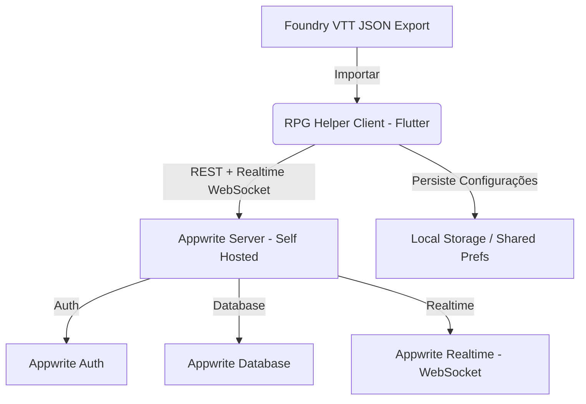
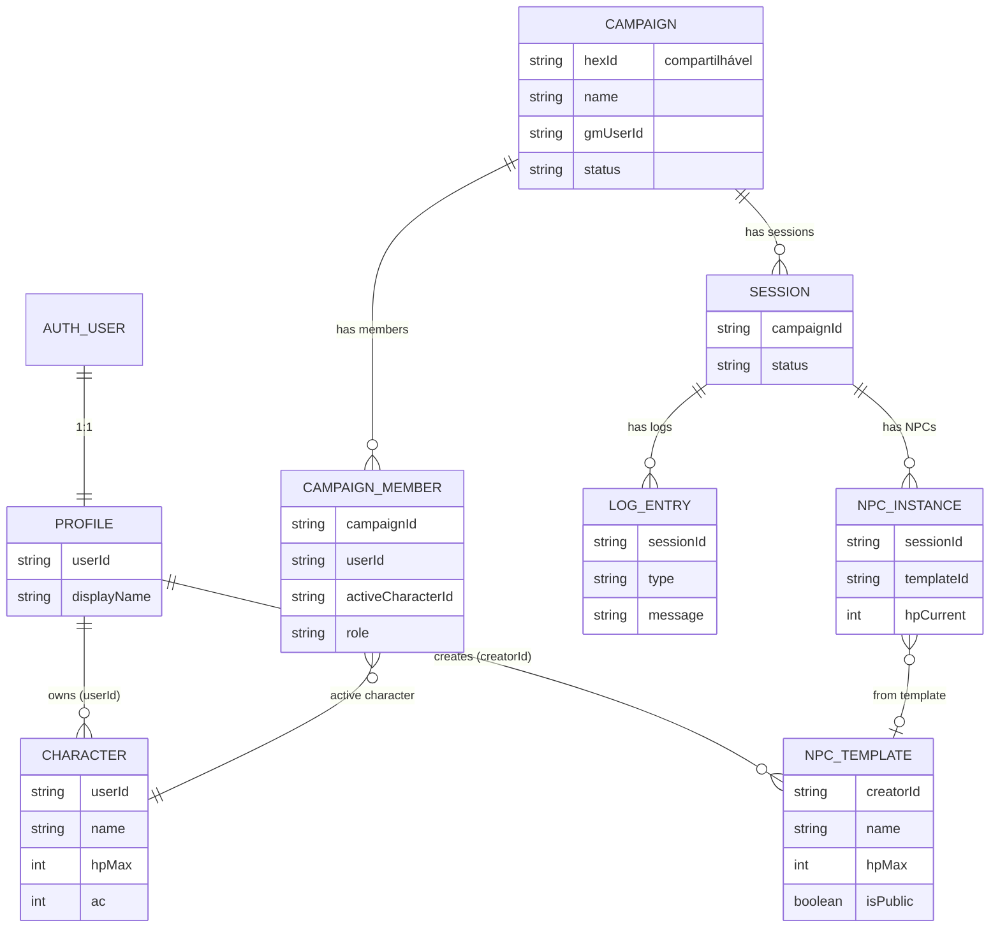

# Documento de Requisitos do Produto (PRD) - RPG Helper

## 1. Visão Geral do Produto

O **RPG Helper** é um aplicativo complementar em tempo real para sessões de RPG de mesa (presencial ou híbrido). Ele resolve a fricção de controle de combate — vida (HP), dano, cura, status — que ocorre tanto no papel e caneta quanto ao usar o Foundry VTT em dispositivos móveis.

### 1.1. Problemas a Serem Resolvidos

1. **Incompatibilidade Mobile do Foundry VTT:** Interface otimizada para desktop, quase inutilizável em smartphones.
2. **Complexidade de Controle de HP:** Rastrear a vida de múltiplos personagens e hordas de monstros no papel gera lentidão e erros.
3. **Falta de Visibilidade para o Grupo:** Jogadores não sabem o estado de aliados ou monstros sem perguntar constantemente ao Mestre.

### 1.2. Objetivos

* Aplicação **focada em combate e gerenciamento de sessões/campanhas**.
* **Cross-platform:** Android nativo + Web responsiva (mesma codebase Flutter).
* **Sincronização instantânea** (tempo real) entre Mestre e Jogadores via Appwrite Realtime.
* **Importação de fichas** do Foundry VTT (JSON) para acelerar preparação.
* Backend **self-hosted** com Appwrite (Auth + Database + Realtime).

---

## 2. Arquitetura Técnica



* **Frontend:** Flutter (Dart) compilado para Android e Web.
* **Backend:** Appwrite self-hosted (Auth + Database + Realtime API via WebSockets).
* **Autenticação:** Cadastro de conta com email/senha via Appwrite Auth. Dados de perfil do jogo em coleção `profiles`.
* **Plataformas alvo:** Android (nativo) e Web (responsivo com breakpoints).

---

## 3. Requisitos Funcionais

### RF01: Cadastro e Autenticação

* **Descrição:** O usuário deve criar uma conta para usar o app.
* **Detalhes:**
    * Cadastro via email/senha usando Appwrite Auth.
    * Ao cadastrar, um documento `profiles` é criado automaticamente com o `userId` do Auth como chave.
    * Login com sessão persistente no dispositivo.
    * Após login/cadastro, redirecionamento à tela principal (Home).
    * Qualquer usuário pode ser Mestre ou Jogador — não há distinção fixa de papel. O papel é definido **por campanha**.

### RF02: Configuração do Servidor Appwrite (Portabilidade)

* **Descrição:** O usuário deve poder configurar o endpoint do seu servidor Appwrite.
* **Detalhes:**
    * Campos: Endpoint URL, Project ID.
    * Dados salvos em `shared_preferences`.

### RF03: Gerenciamento de Campanhas

* **Descrição:** Campanhas são o container principal do jogo. Substituem o conceito de "sala" e "campanha" em uma única entidade.
* **Detalhes:**
    * **Criar Campanha (Mestre):** Gera um ID hexadecimal único (6+ caracteres). O criador se torna o Mestre (`gmUserId`).
    * **Compartilhar Campanha:** Via link direto ou QR Code contendo o ID hex.
    * **Entrar na Campanha (Jogador):** Digita o ID hex ou acessa via link/QR Code. Informa nome de exibição se for o primeiro acesso.
    * **Ao entrar,** o jogador deve selecionar uma de suas fichas como ativa para aquela campanha.
    * Uma campanha pode conter múltiplas sessões.

### RF04: Transferência de Mestre

* **Descrição:** O Mestre pode transferir o bastão para qualquer jogador da campanha.
* **Detalhes:**
    * Ao transferir, **todas** as permissões e atributos de Mestre passam ao novo jogador.
    * **Somente o novo Mestre** pode transferir de volta ou para outro jogador.
    * O antigo Mestre torna-se jogador comum.
    * Implementado como atualização atômica do campo `gmUserId` na campanha, com verificação server-side de que o solicitante é o Mestre atual.

### RF05: Ficha de Personagem (Character Sheet)

* **Descrição:** Jogadores possuem fichas de personagem vinculadas à sua conta.
* **Detalhes:**
    * Um jogador pode ter **múltiplas fichas**.
    * Fichas pertencem ao jogador (`userId` como tenância de dados).
    * Outros jogadores na campanha **visualizam** a ficha ativa do jogador (somente leitura).
    * Campos principais: Nome, HP Atual, HP Máximo, HP Temporário, Classe de Armadura (CA), dados do sistema de origem.
    * Ao entrar numa campanha, o jogador seleciona qual ficha usar como ativa.

### RF06: NPCs — Community Driven

* **Descrição:** NPCs são templates reutilizáveis com modelo comunitário.
* **Detalhes:**
    * O Mestre pode criar NPCs para uso em sua campanha.
    * NPCs criados ficam disponíveis como **templates na comunidade** — outros Mestres podem usá-los em suas próprias campanhas.
    * Tela dedicada de "Biblioteca de NPCs" onde o usuário pode:
        * Navegar NPCs disponíveis na comunidade.
        * Criar novos NPCs (que ficam públicos para outros usarem).
        * Importar NPCs do Foundry VTT (JSON).
    * Ao usar um NPC numa sessão, uma **instância** é criada a partir do template (com HP atual, status, etc.).
    * A instância pertence à sessão e é descartada ao final.

### RF07: Sessões de Jogo

* **Descrição:** Uma sessão representa um dia/encontro de jogo dentro de uma campanha.
* **Detalhes:**
    * Somente o Mestre pode criar e finalizar sessões.
    * Uma campanha pode ter múltiplas sessões (sequenciais).
    * Cada sessão contém:
        * Instâncias de NPCs ativos.
        * Log de eventos (combat log).
        * Status dos personagens dos jogadores naquele momento.

### RF08: Log de Sessão (Combat Feed)

* **Descrição:** Histórico em tempo real de eventos da sessão.
* **Detalhes:**
    * Feed sincronizado via Appwrite Realtime.
    * Tipos de evento (campo `type`):
        * `damage` — "Player bateu no NPC com arma X e deu 10 de dano"
        * `heal` — "Player curou Player em X de cura"
        * `item_use` — "Player usou item X"
        * `death` — "Player/NPC morreu"
        * `custom` — Eventos livres (expansível conforme necessidade)
    * Paginação: carregar últimos 50 eventos, scroll para histórico.
    * Indexação por `sessionId` + `timestamp`.

### RF09: Sincronização em Tempo Real (Appwrite Realtime)

* **Descrição:** Todas as interações entre dispositivos ocorrem via Appwrite Realtime.
* **Detalhes:**
    * Alterações de HP, status, NPCs e logs refletem instantaneamente para todos os conectados na campanha.
    * Listeners ativos nas coleções: `characters`, `npc_instances`, `logs`, `campaign_members`.

### RF10: Painel do Mestre (GM Dashboard)

* **Descrição:** Visão de controle total do combate para o Mestre da campanha.
* **Detalhes:**
    * Visualização de todos os jogadores e NPCs ativos.
    * Ações rápidas: aplicar Dano, Cura, HP Temporário (individual ou em bloco).
    * Criar instâncias de NPCs a partir de templates.
    * Remover NPCs do campo.
    * Criar/finalizar sessões.
    * Transferir papel de Mestre.
    * Finalizar campanha (somente Mestre atual).

### RF11: Painel do Jogador (Player Dashboard)

* **Descrição:** Visão focada no personagem e no grupo.
* **Detalhes:**
    * Controles interativos para alterar o próprio HP (dano/cura recebido).
    * Visualização somente-leitura dos companheiros (fichas ativas).
    * Visualização dos NPCs em campo (estado visual: Saudável, Machucado, Quase Morto — sem HP exato visível, a critério do Mestre).

### RF12: Importação de Ficha do Foundry VTT

* **Descrição:** Importar arquivo JSON exportado do Foundry para criar ficha ou NPC.
* **Detalhes:**
    * Parser inicial com suporte a **D&D 5e**.
    * Extração: `name`, `system.attributes.hp.value`, `system.attributes.hp.max`, `system.attributes.ac.value`.
    * Identificação automática PC vs NPC via campo `type` do JSON.
    * Preview dos dados antes de confirmar importação.
    * Campos não reconhecidos logados para suporte futuro a outros sistemas.
    * Especificação do JSON será fornecida posteriormente.

---

## 4. Modelagem de Dados (Coleções Appwrite)

### 4.1. Auth (Appwrite Auth — nativo)

Gerenciado pelo módulo Auth do Appwrite. Não é coleção customizada.

* Email, senha, sessão, `userId`.

### 4.2. Coleção: `profiles`

Dados de jogo do usuário. Chave = `userId` do Auth.

| Atributo | Tipo | Detalhes |
| :--- | :--- | :--- |
| `userId` | String (255) | ID do Appwrite Auth (tenância) |
| `displayName` | String (255) | Nome de exibição no jogo |
| `avatarUrl` | String (2048) | URL do avatar (opcional) |
| `createdAt` | DateTime | Data de criação |

### 4.3. Coleção: `campaigns`

Container principal do jogo. Combina os conceitos de sala + campanha.

| Atributo | Tipo | Detalhes |
| :--- | :--- | :--- |
| `hexId` | String (12) | ID hex para compartilhamento (6+ chars, indexado, único) |
| `name` | String (255) | Nome da campanha |
| `gmUserId` | String (255) | ID do Mestre atual |
| `status` | String (20) | `active` / `finished` |
| `createdAt` | DateTime | Data de criação |

### 4.4. Coleção: `campaign_members`

Vínculo entre jogadores e campanhas. Define papel e ficha ativa.

| Atributo | Tipo | Detalhes |
| :--- | :--- | :--- |
| `campaignId` | String (255) | FK campanha (indexado) |
| `userId` | String (255) | ID do usuário (tenância, indexado) |
| `activeCharacterId` | String (255) | FK ficha selecionada para esta campanha |
| `role` | String (10) | `gm` / `player` |
| `joinedAt` | DateTime | Quando entrou |

### 4.5. Coleção: `characters`

Fichas de personagem. Pertencem ao jogador.

| Atributo | Tipo | Detalhes |
| :--- | :--- | :--- |
| `userId` | String (255) | Dono da ficha (tenância, indexado) |
| `name` | String (255) | Nome do personagem |
| `hpCurrent` | Integer | HP atual |
| `hpMax` | Integer | HP máximo |
| `hpTemp` | Integer | HP temporário (default 0) |
| `ac` | Integer | Classe de Armadura |
| `sourceSystem` | String (50) | `dnd5e` / `pathfinder` / `manual` |
| `rawJson` | String (100000) | JSON original importado (nullable) |
| `createdAt` | DateTime | Data de criação |

### 4.6. Coleção: `npc_templates`

Biblioteca comunitária de NPCs reutilizáveis.

| Atributo | Tipo | Detalhes |
| :--- | :--- | :--- |
| `creatorId` | String (255) | Quem criou (indexado) |
| `name` | String (255) | Nome do NPC |
| `hpMax` | Integer | HP máximo |
| `ac` | Integer | Classe de Armadura |
| `sourceSystem` | String (50) | Sistema de origem |
| `isPublic` | Boolean | Visível na comunidade (default true) |
| `createdAt` | DateTime | Data de criação |

### 4.7. Coleção: `npc_instances`

Instâncias de NPCs ativos numa sessão. Criados a partir de templates.

| Atributo | Tipo | Detalhes |
| :--- | :--- | :--- |
| `sessionId` | String (255) | FK sessão (indexado) |
| `templateId` | String (255) | FK template de origem (nullable) |
| `name` | String (255) | Nome (pode ser customizado: "Orc 1", "Orc 2") |
| `hpCurrent` | Integer | HP atual |
| `hpMax` | Integer | HP máximo |
| `hpTemp` | Integer | HP temporário (default 0) |
| `ac` | Integer | Classe de Armadura |

### 4.8. Coleção: `sessions`

Sessões de jogo dentro de uma campanha.

| Atributo | Tipo | Detalhes |
| :--- | :--- | :--- |
| `campaignId` | String (255) | FK campanha (indexado) |
| `status` | String (20) | `active` / `finished` |
| `startedAt` | DateTime | Início da sessão |
| `endedAt` | DateTime | Fim da sessão (nullable) |

### 4.9. Coleção: `logs`

Histórico de eventos de combate por sessão.

| Atributo | Tipo | Detalhes |
| :--- | :--- | :--- |
| `sessionId` | String (255) | FK sessão (indexado) |
| `type` | String (20) | `damage` / `heal` / `item_use` / `death` / `custom` |
| `message` | String (1000) | Descrição do evento |
| `actorName` | String (255) | Quem gerou o evento |
| `timestamp` | DateTime | Data/hora ISO8601 (indexado junto com sessionId) |

---

## 5. Diagrama de Relacionamentos



---

## 6. Fluxos de Interface (UI/UX)

```
[ Splash ]
    |
    v
[ Login / Cadastro ] --> Appwrite Auth
    |
    v
[ Home Screen ]
    |--- Criar Campanha --> Gera hex ID --> Mestre
    |--- Entrar na Campanha (ID/Link/QR) --> Seleciona Ficha --> Jogador
    |--- Minhas Fichas --> CRUD de fichas + Importar Foundry
    |--- Biblioteca de NPCs --> Navegar / Criar / Importar
    |
    v
[ Dashboard da Campanha ]
    |--- Mestre: Painel GM (controle total)
    |--- Jogador: Painel Player (ficha + grupo)
    |--- Sessão Ativa: Log de combate + NPCs
```

### Detalhes de Design

* **Visual Premium Dark:** Pretos profundos, cinzas nobres, acentos vibrantes (vermelho/laranja dano, verde cura, azul HP temp, roxo magia/mestre).
* **Feedback Visual:** Micro-animações nas barras de vida ao receber dano/cura.
* **Responsividade com Breakpoints:**
    * **Mobile (< 600px):** Listas verticais, cards grandes, bottom sheets para ações rápidas.
    * **Tablet (600–1024px):** Layout híbrido, sidebar colapsável.
    * **Desktop/Web (> 1024px):** Painel em colunas (NPCs | Jogadores | Logs).

---

## 7. Próximos Passos

1. **Validação deste PRD** pelo usuário.
2. **Setup do projeto Flutter** com estrutura de pastas e dependências.
3. **Configuração do Appwrite** (coleções, índices, permissões).
4. **Implementação por fases** — começando por Auth + Campanhas + Realtime base.
