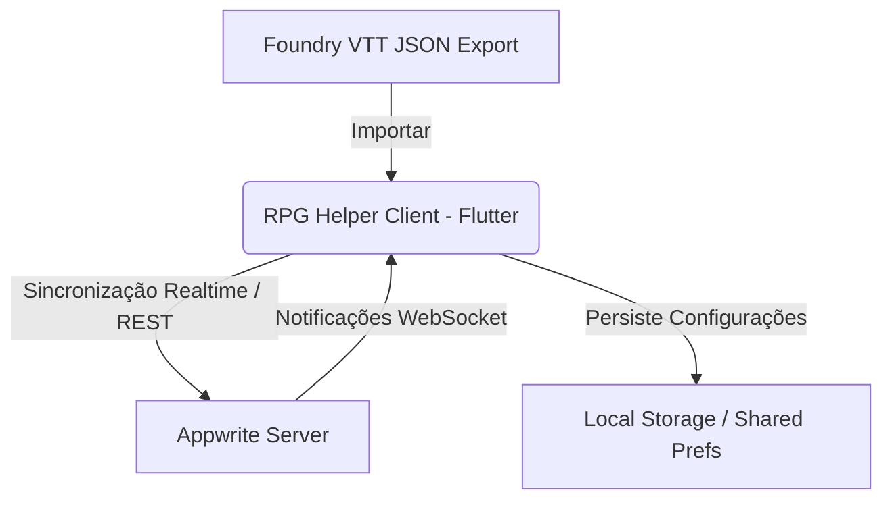

# Documento de Requisitos do Produto (PRD) - RPG Helper

## 1. Visão Geral do Produto
O **RPG Helper** é um aplicativo complementar em tempo real, voltado para sessões de RPG de mesa presencial ou híbrido. Ele visa solucionar a fricção de controle de vida (HP), dano e cura que ocorre tanto no papel e caneta quanto ao usar o Foundry VTT em dispositivos móveis (que costuma ter uma interface pesada e inadequada para telas pequenas).

### 1.1. Problemas a Serem Resolvidos
1. **Incompatibilidade Mobile do Foundry VTT:** A interface do Foundry é otimizada para desktops e se torna quase inutilizável em smartphones.
2. **Complexidade de Controle de HP:** Rastrear a vida de múltiplos personagens e hordas de monstros no papel gera lentidão no combate e erros de cálculo.
3. **Falta de Visibilidade para o Grupo:** Jogadores frequentemente não sabem quanto dano causaram a um monstro ou se um aliado está à beira da morte (precisando perguntar constantemente ao Mestre).

### 1.2. Objetivos
*   Prover uma aplicação simplificada e **focada exclusivamente em combate/HP**.
*   Funcionar de forma **cross-platform** (Web para fácil acesso e Mobile nativo para performance).
*   Garantir **sincronização instantânea** (tempo real) entre o Mestre e os Jogadores.
*   Permitir a **importação direta de fichas** exportadas do Foundry VTT (JSON) para acelerar a preparação do Mestre e jogadores.
*   Utilizar um backend auto-hospedável (**Appwrite**) para gerenciar dados e WebSockets nativos.

---

## 2. Arquitetura Técnica Proposta



*   **Frontend:** Flutter (Dart) compilado para Android, iOS e Web.
*   **Backend/Banco de Dados:** Appwrite (API de Banco de Dados + Realtime API via WebSockets).
*   **Autenticação:** Sessões Anônimas do Appwrite (sem necessidade de cadastro complexo de e-mail/senha para os jogadores entrarem na mesa).

---

## 3. Requisitos Funcionais

### RF01: Configuração do Servidor (Portabilidade)
*   **Descrição:** O usuário deve conseguir definir as credenciais do seu servidor Appwrite na interface do app.
*   **Detalhes:**
    *   Campos: Endpoint URL, Project ID, Database ID, Sessions Collection ID, Characters Collection ID, Logs Collection ID.
    *   Esses dados serão gravados no armazenamento local (`shared_preferences`) e utilizados para instanciar o cliente Appwrite.

### RF02: Autenticação Dinâmica
*   **Descrição:** Entrada rápida no jogo sem fluxos complexos de e-mail/senha.
*   **Detalhes:**
    *   O app tentará recuperar uma sessão existente no dispositivo.
    *   Caso não exista, criará uma **sessão anônima** no Appwrite automaticamente ao entrar ou criar uma sala.

### RF03: Gerenciamento de Sessão (Mesa de Jogo)
*   **Descrição:** Permitir a criação e o ingresso em mesas de jogo.
*   **Detalhes:**
    *   **Criar Mesa (Mestre):** Gera um ID único de sala. O Mestre é marcado como dono (`gmId`).
    *   **Entrar na Mesa (Jogador):** O jogador digita o ID da sala e seu nome de exibição.

### RF04: Ficha Simplificada de HP e Status (Personagem/Monstro)
*   **Descrição:** Exibição clara do estado de saúde dos participantes.
*   **Detalhes:**
    *   Campos: Nome do Personagem, Nome do Jogador, HP Atual, HP Máximo, HP Temporário, Classe de Armadura (CA) e flag `isMonster`.
    *   Visualização gráfica (barra de progresso colorida que muda de cor de acordo com a porcentagem de vida restante).

### RF05: Sincronização em Tempo Real (WebSockets)
*   **Descrição:** Todas as atualizações de HP, dano ou novos monstros devem refletir instantaneamente para todos os conectados.
*   **Detalhes:**
    *   Uso do serviço `Realtime` do Appwrite.
    *   Qualquer mudança de documento na coleção de personagens ou logs atualiza o estado local do Flutter e redesenha a tela de todos os envolvidos.

### RF06: Painel do Mestre (GM Dashboard)
*   **Descrição:** Visão de controle total do combate.
*   **Detalhes:**
    *   Visualização de todos os jogadores e monstros.
    *   Ações rápidas para aplicar Dano, Cura ou HP Temporário (em bloco ou individualmente).
    *   Remoção de monstros/NPCs de campo.
    *   Criação manual rápida de monstros (Nome + HP Max).

### RF07: Painel do Jogador (Player Dashboard)
*   **Descrição:** Visão focada no seu próprio personagem e no status do grupo.
*   **Detalhes:**
    *   Controles interativos e fáceis para alterar o próprio HP (dano/cura recebido).
    *   Visualização somente-leitura dos companheiros de equipe (focado em cooperação).
    *   Visualização dos monstros em campo (para saber quem está machucado). *Opcional: Ocultar o valor numérico exato do HP do monstro, exibindo apenas o estado visual (Saudável, Machucado, Quase Morto).*

### RF08: Importação de Ficha do Foundry VTT
*   **Descrição:** Carregar um arquivo JSON de personagem ou criatura exportado do Foundry.
*   **Detalhes:**
    *   Parser robusto que extrai: `name`, `system.attributes.hp.value` (HP atual), `system.attributes.hp.max` (HP máximo) e `system.attributes.ac.value` (Armadura).
    *   Identificação automática se é criatura/NPC (`isMonster = true`) ou jogador (`isMonster = false`) com base no campo `type` do JSON.

### RF09: Log de Combate (Feed)
*   **Descrição:** Histórico em tempo real de rolagens de dano, curas e eventos da sessão.
*   **Detalhes:**
    *   Feed na parte inferior ou aba lateral.
    *   Mensagens automáticas geradas pelo app quando uma ação de alteração de HP ocorre.
    *   Exemplo: *"Mestre causou 8 de dano a Orc 2"* ou *"Valkyr aplicou 15 de cura em si mesmo"*.

---

## 4. Modelagem de Dados (Coleções Appwrite)

O banco de dados consistirá em 3 coleções no Appwrite.

### 4.1. Coleção: `sessions`
Armazena as salas ativas de jogo.

| Atributo | Tipo | Detalhes |
| :--- | :--- | :--- |
| `name` | String (255) | Nome descritivo da campanha / mesa |
| `gmId` | String (255) | ID do usuário Appwrite do Mestre |

### 4.2. Coleção: `characters`
Armazena a saúde e status de jogadores e monstros de todas as sessões.

| Atributo | Tipo | Detalhes |
| :--- | :--- | :--- |
| `sessionId` | String (255) | Relacionamento com a sessão ativa (Indexado) |
| `name` | String (255) | Nome do personagem / criatura |
| `playerName` | String (255) | Nome do jogador (vazio para monstros) |
| `hpCurrent` | Integer | Vida atual do personagem |
| `hpMax` | Integer | Vida máxima |
| `hpTemp` | Integer | Vida temporária (default 0) |
| `ac` | Integer | Classe de Armadura (CA) |
| `isMonster` | Boolean | True para NPCs/Monstros, False para PCs |
| `ownerId` | String (255) | ID do usuário que criou/importou (segurança) |

### 4.3. Coleção: `logs`
Armazena o histórico recente de eventos de combate da mesa.

| Atributo | Tipo | Detalhes |
| :--- | :--- | :--- |
| `sessionId` | String (255) | Relacionamento com a sessão (Indexado) |
| `message` | String (1000) | Mensagem do evento |
| `timestamp` | String (datetime) | Data e hora em formato ISO8601 |
| `createdBy` | String (255) | Quem gerou o evento (ex: "Mestre", "Aragorn") |

---

## 5. Fluxos de Interface do Usuário (UI/UX)

```
[ Início ]
    |
    v
[ Configuração Appwrite ] ---> Salva no cache local
    |
    v
[ Home Screen ]
    |--- Criar Mesa (Mestre) ---> [ Painel do Mestre (Sincronizado) ]
    |                                   |--> Importar Foundry VTT (JSON)
    |                                   |--> Modificar HP de Monstros/Players
    |
    |--- Entrar na Mesa (Jogador) --> [ Painel do Jogador (Sincronizado) ]
                                        |--> Modificar próprio HP
                                        |--> Ver HP dos aliados e status de monstros
```

### Detalhes de Design (Aesthetics)
*   **Visual Premium Dark:** Paleta de cores moderna com pretos profundos, cinzas de alta qualidade e acentos vibrantes (vermelho/laranja para dano, verde para cura, azul para HP temporário, roxo para detalhes de magia/Mestre).
*   **Feedback Visual Rápido:** Transições suaves nas barras de vida ao receber dano/cura (micro-animações).
*   **Layout Adaptativo (Responsivo):**
    *   **Mobile:** Focado em listas verticais de toque fácil (cards grandes para clicar e abrir ajuste rápido de HP).
    *   **Web/Desktop:** Painel em colunas (Monstros | Jogadores | Logs).

---

## 6. Próximos Passos Sugeridos
1. **Revisão deste PRD:** O usuário valida a proposta técnica e de produto.
2. **Instalação e Setup do Appwrite:** Como criar o projeto e as tabelas com os índices no servidor do usuário.
3. **Desenho e Estruturação do Código Flutter:** Início da implementação das telas conforme revisado.
